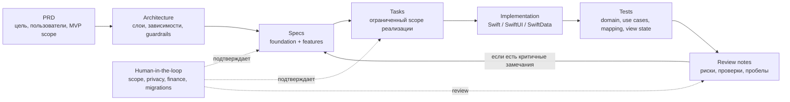
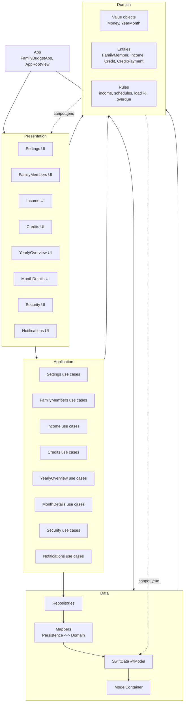
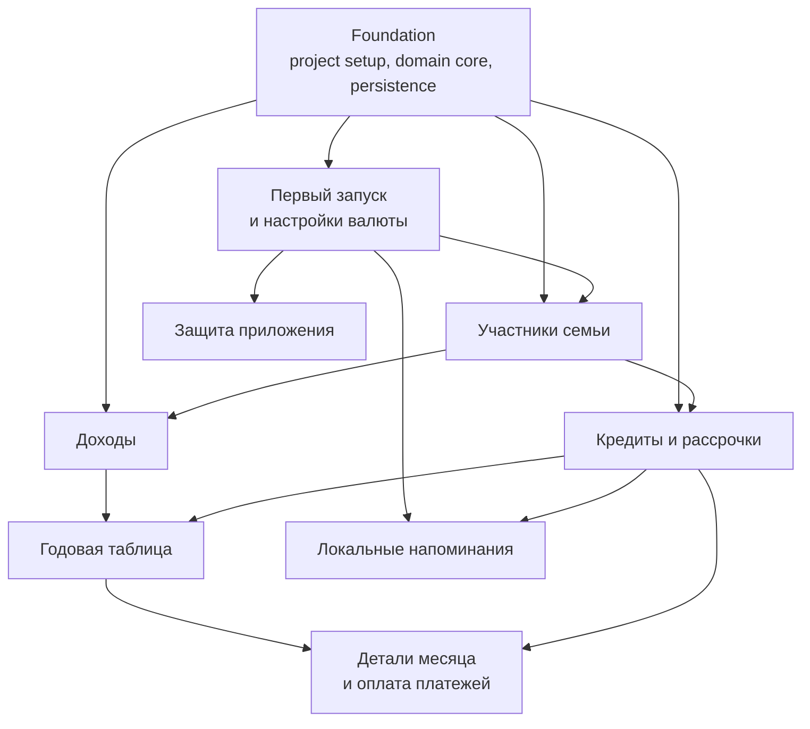
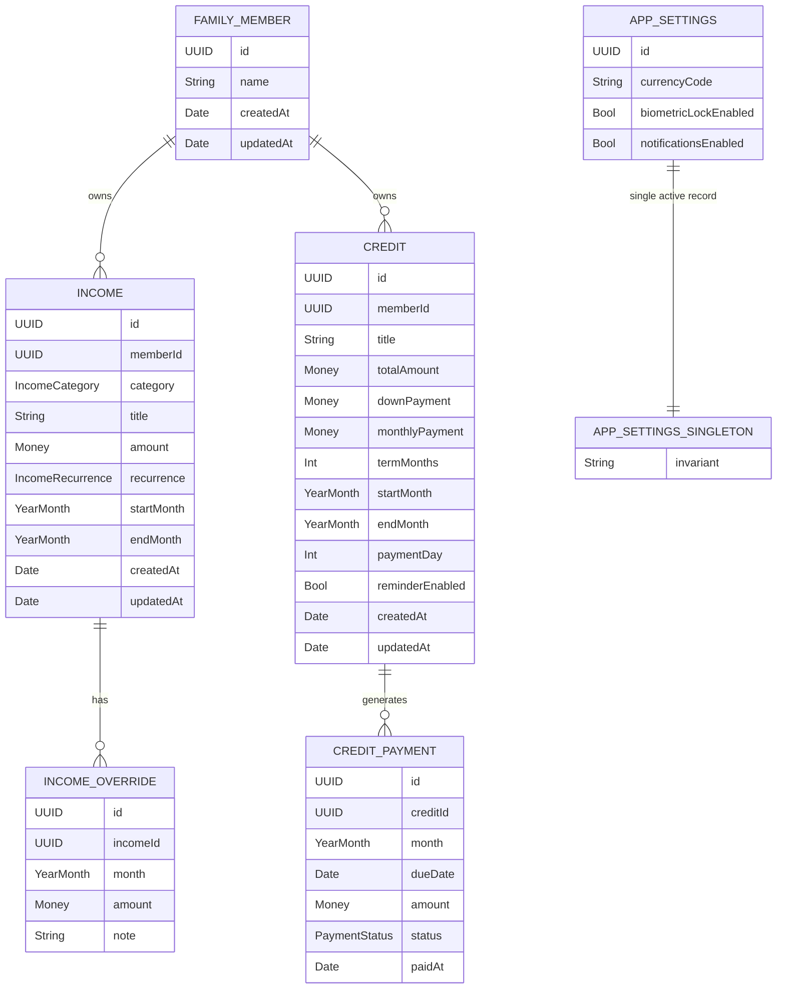
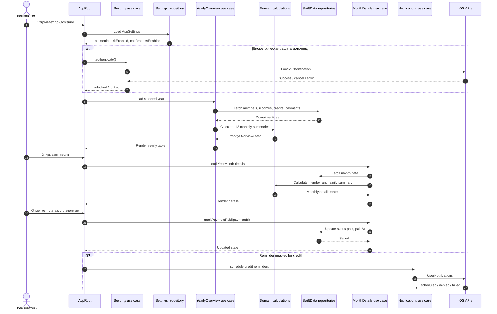

# Mermaid-диаграммы архитектуры и проектных спецификаций

Дата: 2026-05-11  
Статус: draft for human review  
Связанные документы:

- `ARCHITECTURE-MVP.md`
- `../specs/features/mvp-feature-catalog.md`
- `../tasks/mvp-task-catalog.md`

## 1. Spec Driven Development flow

## 2. Layered monolith + vertical slices

## 3. MVP feature dependencies

## 4. Conceptual data model

## 5. Main runtime flows

